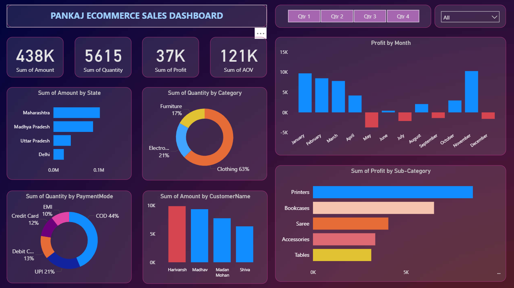

# Power-BI-Project
This project demonstrates an interactive Power BI dashboard designed for an e-commerce business to analyze and track online sales performance.

🔑 Key Features

- Built an interactive dashboard to monitor sales, profit, and customer behavior.
- Implemented filters, slicers, and drill-down parameters for dynamic insights.
- Created relationships, joins, and calculated measures to transform raw data into meaningful KPIs.
- Designed customized visualizations including bar, pie, donut, clustered bar, scatter, line, area, and map charts.
- Enhanced user-driven analysis through interactive navigation and slicers.

📷 Dashboard Preview

 

📂 Files in this Repository

- [Pankaj_E-Commerce_Dashboard.pbix](./Pankaj_E-Commerce_Dashboard.pbix) → Power BI project file.
    - Main Power BI project file containing the dashboard and all visualizations.
      
- Datasets (CSV format):
  
  1. [Details.csv](./Details.csv)
       - Contains customer details, product information, and supporting reference data.
  3. [Orders.csv](./Orders.csv)
       - Contains sales transaction records including order date, product, quantity, sales, and profit.

